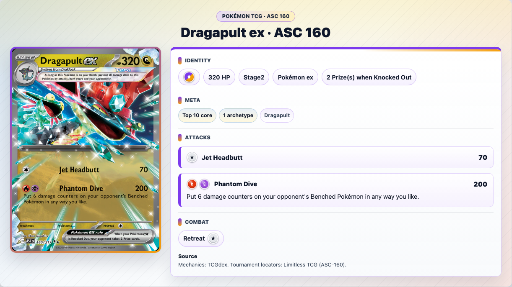

# Pokémon TCG Meta Anki

Reproducible Anki deck builder for recognizing cards in the competitive Pokémon
TCG metagame.

Snapshot: **2026-06-25**



The preview above is a single low-resolution screenshot of a rendered Dragapult
ex card back. Generated `.apkg` files and downloaded media directories are
intentionally not published here.

## Included Pool

- [Mechanical card roster](generated/mechanical_card_roster.csv)
- [Included set catalog](data/set_catalog.csv)
- [Top 50 archetype ranking](data/archetypes_top50.csv)
- [Source print locators](data/card_source_locators_top50_361.csv)

The pool starts from combined classified archetype entries from:

- 2026 North America International Championships, Limitless Labs event `0070`;
- 2026 Turin Special Event, Limitless Labs event `0069`.

The `Other` bucket is excluded. The top 50 named archetypes are ranked by
combined field share, then one representative NAIC 60-card list is selected for
each archetype. Those lists expand to exact set-code/collector-number locators,
which are resolved through TCGdex, normalized into gameplay fields, and checked
for exact mechanical reprints.

## Snapshot Stats

This snapshot produces **361 card notes** from the top 50 archetypes. Of those,
**145 notes** also appear in at least one top-10 archetype list, so they get an
extra top-10 tag.

| What | Count |
|---|---:|
| Archetypes covered | 50 |
| Card notes | 361 |
| Top-10-tagged notes | 145 |
| Sets represented | 18 |

| Card type | Notes |
|---|---:|
| Pokémon | 220 |
| Trainer | 120 |
| Energy | 21 |

## Build

Install dependencies:

```bash
sfw uv sync
source .venv/bin/activate
```

Validate the frozen source data:

```bash
make test
make validate-source
```

Rebuild the resolved card pool:

```bash
make resolve
make discover
make materialize
make validate-resolved
```

Generate a no-media `.apkg`:

```bash
make build-no-art
```

Generate a media-bearing `.apkg` for personal study:

```bash
make media
make crop
python scripts/build_anki.py
```

The media pipeline downloads card images and creates artwork crops under
`media/`; package outputs go under `dist/`. Both directories are ignored by Git.

## Repository Map

```text
data/        Frozen source lists, overrides, and natural-key inputs
generated/   Audited generated rosters and archetype membership tables
media/       Local-only downloaded images and crops
reports/     Validation and build summaries
schemas/     JSON schemas and Anki note-model specs
scripts/     Resolver, materializer, media, crop, and Anki build scripts
templates/   Anki HTML/CSS templates
tests/       Source, identity, template, and smoke tests
```

## Provenance

- Limitless TCG: tournament archetype pages, representative list encodings, and
  set/collector-number locators.
- TCGdex: structured card and set data used during resolution.
- Official Pokémon sources: preferred authority for rules, errata, legality, and
  bans when third-party data conflicts.

This project is not affiliated with, endorsed by, or sponsored by The Pokémon
Company, Nintendo, Creatures, Game Freak, Limitless TCG, TCGdex, or Anki.
Pokémon names, card text, artwork, logos, and related marks belong to their
respective rights holders. See [PROVENANCE.md](PROVENANCE.md) and
[LICENSE_NOTES.md](LICENSE_NOTES.md) for more detail.
